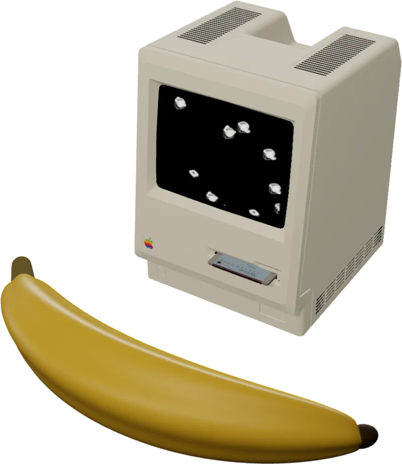
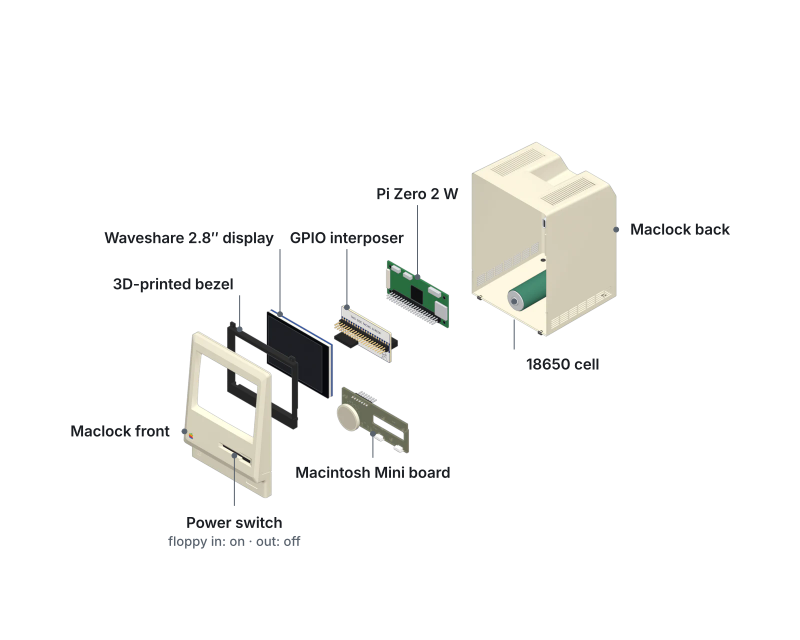
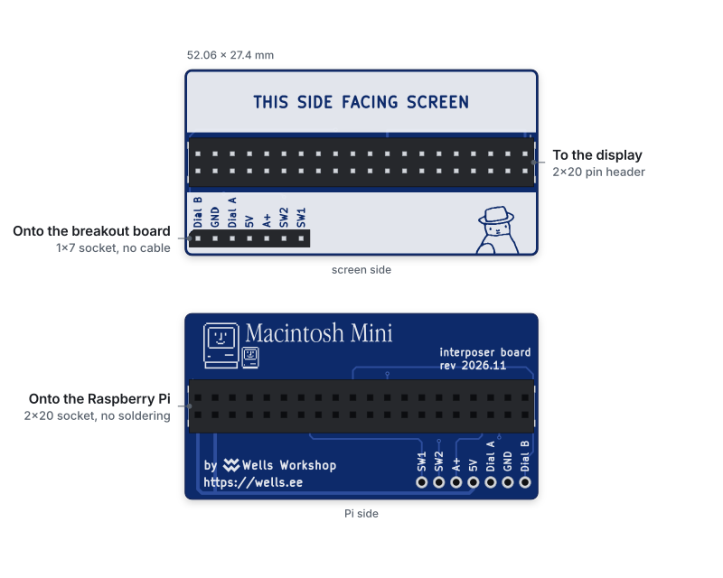
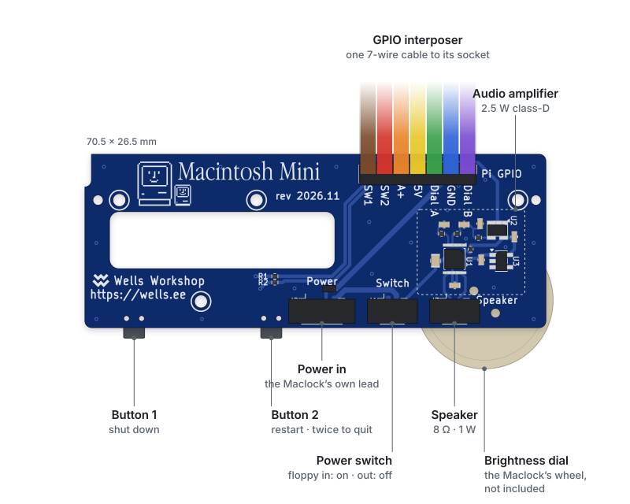

# Turn a Maclock into a working Mac

<!-- github-only -->
<p align="center">
  
</p>
<!-- /github-only -->

The Maclock is a novelty alarm clock shaped like the 1984 Macintosh, sold online for about $20. Its shell is accurate enough that it can hold a real computer. This guide replaces its insides with a Raspberry Pi Zero 2 W and a 2.8-inch screen, so the clock boots classic Mac OS, plays the startup chime and runs vintage software. The front dial sets the screen brightness, the two buttons restart and shut down, and Wi-Fi, Bluetooth, USB and the internal battery all work.

The full build is also on video: [Turning a $20 AliExpress clock into a real vintage Macintosh](https://www.youtube.com/watch?v=zAbAf5-H5Yo) (21 minutes).

<!-- shop:photo -->

## Buy it or build it

<!-- shop:builds -->

<!-- github-only -->
Kits and a finished Mac are available from [Wells Workshop](https://shop.wells.ee/products/macintosh-mini/?ref=gh-macintosh-mini):

- [**Fully assembled**](https://shop.wells.ee/products/macintosh-mini/?ref=gh-macintosh-mini): nothing to build. Copy over your ROM and disk image.
- [**DIY kit, pre-soldered**](https://shop.wells.ee/products/macintosh-mini/diy-kit-soldered/?ref=gh-macintosh-mini): wire it up, flash the card, close the case. No soldering.
- [**DIY kit**](https://shop.wells.ee/products/macintosh-mini/diy-kit/?ref=gh-macintosh-mini): solder the board yourself. The parts are tiny: a microscope helps.
<!-- /github-only -->

The design is open source, so you can also order the bare board from [PCBWay](https://www.pcbway.com/project/shareproject/W654223ASS41_Untitled_kicad_pcb_95cca7e3.html) and source every part from the [bill of materials](maclock-pcb/). The rest of this guide is the same either way.

## What you need

**Parts**

- A Maclock
- A Raspberry Pi Zero 2 W (or a Pi 3 Model A+)
- A Waveshare 2.8-inch IPS LCD (the DPI version)
- The Macintosh Mini board, which connects the clock's dial, buttons, power switch, battery and speaker to the Pi, and carries the audio amplifier
- A small speaker: 8 Ω, 1 W, 28–40 mm, with a 1.25 mm PicoBlade plug (often sold as "JST 1.25")
- A 3D-printed screen bezel ([STL file](maclock-screen-bezel/))
- A way to connect the board to the Pi: the GPIO interposer (recommended), or 7 jumper wires with a female end on one side
- A microSD card, 32 GB (16 GB also works)
- Optional: a micro-USB to USB-A cable, to add a USB port on the back for a keyboard or mouse

<!-- github-only -->
**Where to buy:** [Maclock](https://amzn.to/4e7FKrw) · [Raspberry Pi Zero 2 W](https://amzn.to/4ac7FVR) · [Waveshare 2.8-inch LCD](https://amzn.to/4ue5GaP) · [speaker](https://www.adafruit.com/product/3923) · [Macintosh Mini board](https://www.pcbway.com/project/shareproject/W654223ASS41_Untitled_kicad_pcb_95cca7e3.html) from PCBWay ([$5 off with my referral code](https://pcbway.com/g/AsfKU9)) · [micro-USB to USB-A cable](https://www.aliexpress.us/item/3256807845070147.html?gatewayAdapt=glo2usa#nav-specification) (choose `Color: OTGV8DO-AFH`) · the GPIO interposer, from [Wells Workshop](https://shop.wells.ee/products/macintosh-mini/?ref=gh-macintosh-mini)
<!-- /github-only -->

**Tools**

- A thin opening pick or metal pry tool (the kind used to open iPods)
- A small screwdriver
- Flush cutters, if you remove the touch pad's wires
- A soldering iron, if you use wires instead of the interposer
- A rotary tool such as a Dremel, if you add a USB port
- A computer to flash the SD card and copy files to the Pi

**Software you supply**

- A Mac ROM file. Basilisk II, the default emulator, needs a 512 KB or 1 MB 68k ROM from a Mac IIci or Quadra (`064DC91D` is a common one). Apple's ROMs are copyrighted, so no kit includes one.
- A Mac OS disk image with System 7.0 to 8.5. The [BlueSCSI image library](https://bluescsi.com/docs/BlueSCSI-Images) has ready-made ones.

<picture>
  <source media="(prefers-color-scheme: dark)" srcset="docs/drawings/exploded-dark.svg">
  
</picture>

## 1. Open the Maclock

Leave the screws on the back alone. They are real, but they don't hold the front and back together: plastic clips do.

Push a thin opening pick or a metal pry tool, the kind used to open iPods, into the seam between the front and back shells, and work it until the first clip pops open. The first clip is the hardest, and there's no trick to it. Once it gives, the rest come apart much more easily. Go slowly to avoid breaking the clips, though breaking one isn't a disaster.

Inside, unscrew the clock board, unplug its connectors and lift it out. Keep the battery and its charging board. The Macintosh Mini board takes the clock's 4-wire power plug and 2-wire power-switch plug, so the clock's own power switch still works: push the little floppy disk into its slot to turn the Mac on, and pull it out to turn it off. The battery still runs it unplugged.

Take out the clock's screen, but leave its clear plastic lens in the front shell. The touch-sensitive pad on top of the case isn't used: cut its wires, or leave them where they are.

## 2. Connect the Pi to the screen and the board

The Macintosh Mini board talks to the Pi over five GPIO pins: the dial (two pins), the two buttons and the audio. The Waveshare display plugs onto the Pi's 40-pin header and uses some of the same pins, and when it does, the buttons and dial behave erratically. There are two ways around this.

**With the GPIO interposer (recommended).** Press the interposer onto the Pi's header, then press the display onto the interposer. The interposer keeps the five pins away from the display and brings them out on one 7-pin socket on the screen side, in the same order as the board's header, so a single straight 7-wire cable joins the two. Nothing on the Pi is cut or bent. It adds about 12.5 mm between the Pi and the display.

<picture>
  <source media="(prefers-color-scheme: dark)" srcset="docs/drawings/interposer-dark.svg">
  
</picture>

**With wires.** Cut or desolder pins 13, 19, 23, 35 and 37 on the Pi's header so they don't reach the display. Then solder a wire to the back of the Pi at each pin in the table below, and plug the female ends onto the board's "Pi GPIO" header:

| Board pin | Pi pin | What it carries |
| --- | --- | --- |
| 5V | 2 | Power from the clock to the Pi |
| GND | 6 | Ground |
| SW1 | 13 | The right button |
| Dial B | 19 | Brightness dial |
| Dial A | 23 | Brightness dial |
| A+ | 35 | Audio to the amplifier |
| SW2 | 37 | The left button |

## 3. Fit the board and connect the clock's plugs

The Macintosh Mini board is a drop-in replacement for the clock board: it fits where the old board was, and the same screws hold it in. It has three small connectors, labelled on the board:

- **Power:** the clock's 4-wire plug. The board takes 5 V and ground from it and passes them to the Pi.
- **Switch:** the clock's 2-wire power-switch plug.
- **Speaker:** the speaker's 2-wire plug. Either way round works.

The board has no voltage regulator: the Pi runs straight from the clock's 5 V supply.

<picture>
  <source media="(prefers-color-scheme: dark)" srcset="docs/drawings/board-dark.svg">
  
</picture>

## 4. Fit the screen

Print the bezel at 0.2 mm layers with no supports; black PLA or PETG hides it best. It frames the 2.8-inch panel inside the clock's original screen opening.

The bezel screws in at the top, into the posts that held the clock's screen, with the same screws. Clips along its bottom edge hold the bottom of the screen. The Pi needs no mount of its own: it hangs off the back of the screen, plugged into it directly or through the interposer. No tape or glue is needed anywhere.

The fit should be snug, not tight. If the panel has to be forced in, sand the bezel's inner edges or print it slightly larger: pressing a tight bezel onto the LCD can crack it.

**Optional: a USB port on the back.** The back shell has no opening for one, so cut a rectangular hole with a rotary tool such as a Dremel. The top right corner of the back shell, where the fake battery door is, works best. Push the USB-A end of the cable through the hole and plug its micro-USB end into the Pi's data port (marked USB, not PWR).

## 5. Install the software

1. Flash **Raspberry Pi OS Lite (64-bit)** onto the microSD card with [Raspberry Pi Imager](https://www.raspberrypi.com/software/). Set your Wi-Fi network and turn on SSH in its settings, so you can reach the Pi without a keyboard.
2. Boot the Pi and find its IP address.
3. Rename your ROM file to `ROM`, with no extension, and copy it and your disk image to the Pi's home folder:

   ```bash
   scp ROM yourdisk.hda <user>@<pi_ip>:~/
   ```

   Disk images named `.hda`, `.dsk`, `.img`, `.hfv` or `.sparsebundle` work. `.dmg`, `.image`, `.smi`, `.toast` and zipped or StuffIt files do not.

4. Connect to the Pi over SSH and run the installer:

   ```bash
   curl -fsSL https://raw.githubusercontent.com/wr/macintosh-mini/main/setup.sh | bash
   ```

   It finds the ROM and disk image, installs the emulator, the display drivers and the button and dial services, then restarts the Pi. The Pi then boots straight into Mac OS.

**Which emulator.** The installer offers two. **Basilisk II** (the default) emulates a 68k Mac running System 7.0 to 8.5 and is the fastest choice on a Pi Zero 2 W. **SheepShaver** emulates a PowerPC Mac running Mac OS 8.1 or later. It needs a 4 MB PowerPC ROM and is very slow on a Pi Zero, so choose it only for PowerPC-only software.

**Updating.** Run the installer again at any time. It keeps your disk image and settings. To switch emulator, add `--sheepshaver` or `--basilisk` to the end of the command (`curl … | bash -s -- --sheepshaver`). Each emulator keeps its own settings and needs its own ROM.

**Installing by hand.** The [manual install](maclock-build/README.md) walks through what the installer does, step by step.

## Using it

- **The dial** sets the screen brightness. It can also dim the screen after sunset and turn it off overnight ([night dimming](maclock-build/README.md#night-dimming-optional)).
- **The right button** shuts the Pi down safely.
- **The left button** restarts Mac OS, with the crash sound. Pressed twice quickly, it quits to the Pi's command line instead.
- To change what either button does, edit `COMMANDS` and `DOUBLE_COMMANDS` in [`button_handler.py`](maclock-build/button_handler.py).
- **Shut Down** in Mac OS (Special → Shut Down) quits to the Pi's command line, and **Restart** restarts the Mac. A crash restarts it on its own. Type `macintosh` at the command line to start the Mac again.
- **Networking** works out of the box. In Mac OS, set TCP/IP to DHCP.

## Troubleshooting

**The buttons or dial do strange things.** The display is using pins the board needs. Use the GPIO interposer, or check that pins 13, 19, 23, 35 and 37 don't reach the display.

**The dial jumps or turns the wrong way.** The encoder is worn. A good one clicks firmly; a mushy one can't be fixed in software. Clean its contacts or replace it.

**The disk image won't boot.** Check its format: `.dmg`, `.image`, `.smi` and `.toast` files and anything still zipped don't work. Convert it to a raw image, or use one from the BlueSCSI library.

**The Pi drops off Wi-Fi or SSH is slow to answer.** The Pi Zero's Wi-Fi power saving is on. The installer turns it off; if you set the Pi up by hand, see [Keep the Wi-Fi awake](maclock-build/README.md#4-keep-the-wi-fi-awake).

**The speaker buzzes at low brightness.** The Pi's analogue audio picks up noise from the display's backlight signal. A USB audio adapter removes it.

**The hostname changes back after a restart.** Raspberry Pi OS resets it on every boot. Give the installer a hostname and it fixes this, or see [Known issues](maclock-build/README.md#known-issues).

Anything else: open an issue on [GitHub](https://github.com/wr/macintosh-mini/issues).

## Questions

**Which versions of Mac OS does it run?** System 7.0 to 8.5 with Basilisk II, or Mac OS 8.1 and later with SheepShaver.

**Is a ROM included?** No. Apple's ROMs are copyrighted; use one from a Mac you own.

**Does it still work as a clock?** In a way: the clock board comes out, but Mac OS shows the time.

**How long does the build take?** About an hour with the pre-soldered kit, from opening the clock to the System 7 desktop. Allow another hour to solder the DIY kit.

**Which Raspberry Pi models work?** The Pi Zero 2 W and the Pi 3 Model A+ are tested. Other models may work but haven't been tried. The original Pi Zero and Zero W can't run the 64-bit Pi OS the installer needs.

---

The Macintosh Mini board's design is licensed under [CC BY-NC-SA 4.0](maclock-pcb/LICENSE).

<!-- github-only -->
This guide is also on the shop, at [shop.wells.ee/guides/macintosh-mini](https://shop.wells.ee/guides/macintosh-mini/?ref=gh-macintosh-mini), which copies it from here: edit this file, not that page.
<!-- /github-only -->
