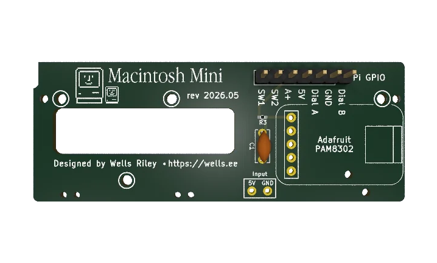

<h1 align="center"> Macintosh Mini</h1>

<p align="center">
  <strong>Turn a Maclock alarm clock into a working Mac with a Raspberry Pi Zero.</strong>
</p>

<p align="center">
  <a href="#what-is-it">What is it?</a> ⬪
  <a href="#shopping-list">Shopping list</a> ⬪
  <a href="#hardware-build">Hardware build</a> ⬪
  <a href="#software--quick-install">Software install</a> ⬪
  <a href="#donate">Donate</a>
</p>

<p align="center">
  <a href="https://www.youtube.com/watch?v=zAbAf5-H5Yo"></a>
</p>

<p align="center">
  <sub>I recorded a full build video that <a href="https://www.youtube.com/watch?v=zAbAf5-H5Yo">you can watch here</a>.</sub>
</p>

---

## What is it?

A [Maclock](https://www.aliexpress.us/w/wholesale-maclock.html) is a cheap alarm clock built into a shockingly accurate miniature Macintosh shell. This project guts one and rebuilds it around a Raspberry Pi Zero running a real 68k or PowerPC emulator, so the tiny Mac actually boots System 7, plays the startup chime, and runs vintage software. Buttons, brightness, sound, wi-fi, bluetooth, and battery all work.

## Shopping List

- [Maclock](https://amzn.to/4e7FKrw)
- [Raspberry Pi Zero 2 W](https://amzn.to/4ac7FVR)
- [Waveshare 2.8 inch IPS LCD](https://amzn.to/4ue5GaP)
- [Adafruit PAM8302 audio amp](https://amzn.to/4uITeAP) + small speaker
- [3D printed screen bezel](./maclock-screen-bezel)
- [Macintosh Mini breakout board](./maclock-pcb) — for brightness, buttons, and sound. Order from [PCBway](https://www.pcbway.com/project/shareproject/W654223ASS41_Untitled_kicad_pcb_95cca7e3.html).
- [MicroUSB to USB-A female cable](https://www.aliexpress.us/item/3256807845070147.html?gatewayAdapt=glo2usa#nav-specification) — to add a USB port to the back. Choose `Color: OTGV8DO-AFH`.

<p align="center">
  
</p>

## Hardware Build

Follow the [Maclock hardware guide](https://github.com/wr/macintosh-mini/tree/main/maclock-build) to assemble the Macintosh Mini. I also recorded a [walkthrough video](https://www.youtube.com/watch?v=zAbAf5-H5Yo) that goes into much more detail than the written guide.

## Software — Quick Install

1. **Flash the OS.** Install [Raspberry Pi OS (Lite) 64-bit](https://www.raspberrypi.com/software/) onto an SD card.

2. **Bring your own Mac OS.** Copy a Mac OS disk image and a ROM file to the Pi — the installer auto-discovers them in `$HOME`. Two emulators are offered (it defaults to **Basilisk II**):

   - **Basilisk II** — a 68k Mac running System 7.0–8.5. Fastest option on the Pi Zero 2 W. Needs a **512 KB or 1 MB 68k ROM** (Mac IIci / Quadra — try searching online for `064DC91D`) and a disk image.
   - **SheepShaver** — PowerPC running Mac OS 8.1+. Needs the **4 MB PowerPC [ROM](https://www.redundantrobot.com/sheepshaver)** and a disk image. Choose this only if you need PPC-era software — it's **very slow on a Pi Zero**.

   Rename your ROM file to `ROM` (no extension). Disk images are readily available online; I recommend the [BlueSCSI image library](https://bluescsi.com/docs/BlueSCSI-Images).

   > **Disk images that work:** any raw hard-disk image — `.hda`, `.img`, `.dsk`, `.hfv`, `.vhd` (the extension doesn't matter) — and Apple `.sparsebundle`.
   > **Don't work:** `.dmg`, `.image` / `.smi`, `.toast`, or anything still zipped (`.zip` / `.sit`).

   ```bash
   scp ROM yourdisk.hda <user>@<pi_ip>:~/
   ```

3. **Run the installer.** SSH into the Pi and run:

   ```bash
   curl -fsSL https://raw.githubusercontent.com/wr/macintosh-mini/main/setup.sh | bash
   ```

4. The script reboots your Pi when done, and it should Just Work™️.

## Using it

The Pi boots straight into the Mac. A few controls:

- **Reset button** (GPIO 26): a single press restarts the emulator; a **double press quits to a Pi shell prompt**.
- **Shut Down** from inside Mac OS (Special → Shut Down) quits to the Pi prompt; **Restart** reboots the Mac in place; a crash auto-reboots.
- **`macintosh`** — run this from the prompt to boot the Mac again.
- **Networking** works out of the box (slirp NAT). In the Mac, set TCP/IP to **DHCP**.

Re-run the installer any time to **update** an existing install — it keeps your disk image and settings. To **switch emulator**, pick the other one (Basilisk II ⇄ SheepShaver); each core's prefs are preserved.

## The software — manual install

Prefer to do it by hand? Every step the script runs is documented:

- [Maclock hardware guide](https://github.com/wr/macintosh-mini/tree/main/maclock-build)
- [Basilisk II install guide](https://github.com/wr/macintosh-mini/blob/main/emulators/BasiliskII.md)
- [SheepShaver install guide](https://github.com/wr/macintosh-mini/blob/main/emulators/SheepShaver.md)

## Getting help

Open a [GitHub issue](https://github.com/wr/macintosh-mini/issues) — happy to help.

## Credits

Startup chimes and crash sounds are mirrored from D. Schaub's Apple Sounds collection at <https://froods.ca/~dschaub/sound.html>. All sounds are © Apple, Inc.

## Donate

While this project is free and open source, donations are deeply appreciated, and make ongoing development and support possible.
[Donate now](https://www.buymeacoffee.com/wellsworkshop)

## License

Copyright © 2026 Wells Riley. The [`maclock-pcb/`](./maclock-pcb/) PCB design is licensed under [CC BY-NC-SA 4.0](./maclock-pcb/LICENSE). The rest of the repository is published as-is for personal, non-commercial use.
