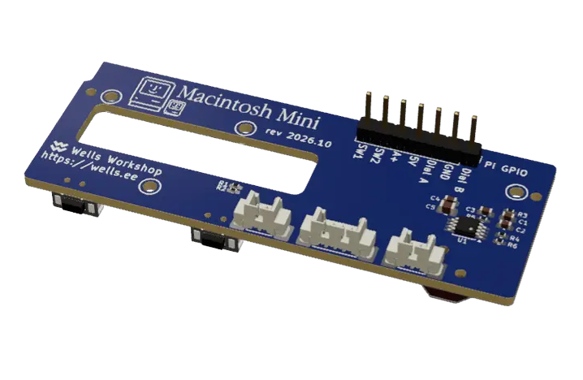

<h1 align="center"> Macintosh Mini</h1>

<p align="center">
  <strong>Turn a Maclock alarm clock into a working Mac with a Raspberry Pi Zero.</strong>
</p>

<p align="center">
  <a href="#what-is-it">What is it?</a> ⬪
  <a href="BUILD.md">Build guide</a> ⬪
  <a href="#parts">Parts</a> ⬪
  <a href="#install-or-update-the-software">Software</a> ⬪
  <a href="#donate">Donate</a>
</p>

<p align="center">
  <a href="https://www.youtube.com/watch?v=zAbAf5-H5Yo"></a>
</p>

<p align="center">
  I recorded a full build video that <a href="https://www.youtube.com/watch?v=zAbAf5-H5Yo">you can watch here</a>.
</p>

<p align="center">
  Rather not source the parts? <a href="https://shop.wells.ee/products/macintosh-mini/?ref=gh-macintosh-mini">Get a kit or a finished Mac</a> from the Wells Workshop shop.
</p>

---

## What is it?

A [Maclock](https://www.aliexpress.us/w/wholesale-maclock.html) is a cheap alarm clock built into a shockingly accurate miniature Macintosh shell. This project guts one and rebuilds it around a Raspberry Pi Zero running a real 68k or PowerPC emulator, so the tiny Mac actually boots System 7, plays the startup chime, and runs vintage software. Buttons, brightness, sound, Wi-Fi, Bluetooth, and battery all work.

## Build one

The [build guide](BUILD.md) takes you from opening the clock to the first boot: parts and tools, assembly, installing the software, and troubleshooting. I also recorded a [video of my build](https://www.youtube.com/watch?v=zAbAf5-H5Yo).

## Parts

Sourcing the parts yourself? These are the ones I used; the [build guide](BUILD.md#what-you-need) lists everything, including tools. Or get it all from [the shop](https://shop.wells.ee/products/macintosh-mini/?ref=gh-macintosh-mini): a kit, pre-soldered or not, with the bezel, speaker and interposer as add-ons, or a finished Mac.

- [Maclock](https://amzn.to/4e7FKrw)
- [Raspberry Pi Zero 2 W](https://amzn.to/4ac7FVR)
- [Waveshare 2.8 inch IPS LCD](https://amzn.to/4ue5GaP)
- [Adafruit PAM8302 audio amp](https://amzn.to/4uITeAP) + small speaker
- [3D printed screen bezel](./maclock-screen-bezel)
- Macintosh Mini breakout board — for brightness, buttons, and sound. Order from [PCBway](https://www.pcbway.com/project/shareproject/W654223ASS41_Untitled_kicad_pcb_95cca7e3.html).
    -  You can [use my referral code](https://pcbway.com/g/AsfKU9) to get $5 off your order, if you want.
- [MicroUSB to USB-A female cable](https://www.aliexpress.us/item/3256807845070147.html?gatewayAdapt=glo2usa#nav-specification) — to add a USB port to the back. Choose `Color: OTGV8DO-AFH`.

<p align="center">
  
</p>

## Install or update the software

Already built one? Copy your ROM (renamed `ROM`) and a disk image to the Pi's home folder, then run the installer over SSH:

```bash
curl -fsSL https://raw.githubusercontent.com/wr/macintosh-mini/main/setup.sh | bash
```

Run it again any time to update: it keeps your disk image and settings. [Install the software](BUILD.md#5-install-the-software) in the build guide covers which ROMs and disk images work, and [`CHANGELOG.md`](CHANGELOG.md) lists what each version changed.

## What's in this repo

- [`BUILD.md`](BUILD.md): the build guide.
- [`setup.sh`](setup.sh): the installer.
- [`maclock-build/`](maclock-build/): the manual install, part 1. Sets up the Pi's display, dial and buttons by hand, the way the installer does. Also the design notes and known issues.
- [`emulators/`](emulators/): the manual install, part 2. Builds and runs Basilisk II or SheepShaver. Also the startup chimes.
- [`maclock-pcb/`](maclock-pcb/): the Macintosh Mini board's KiCad project and bill of materials.
- [`maclock-screen-bezel/`](maclock-screen-bezel/): the 3D-printable screen bezel.

## Getting help

Open a [GitHub issue](https://github.com/wr/macintosh-mini/issues) — happy to help.

## Credits

Startup chimes and crash sounds are mirrored from D. Schaub's Apple Sounds collection at <https://froods.ca/~dschaub/sound.html>. All sounds are © Apple, Inc.

## Donate

While this project is free and open source, donations are deeply appreciated, and make ongoing development and support possible.
[Donate now](https://www.buymeacoffee.com/wellsworkshop)

## License

Copyright © 2026 Wells Riley. The [`maclock-pcb/`](./maclock-pcb/) PCB design is licensed under [CC BY-NC-SA 4.0](./maclock-pcb/LICENSE). The rest of the repository is published as-is for personal, non-commercial use.
