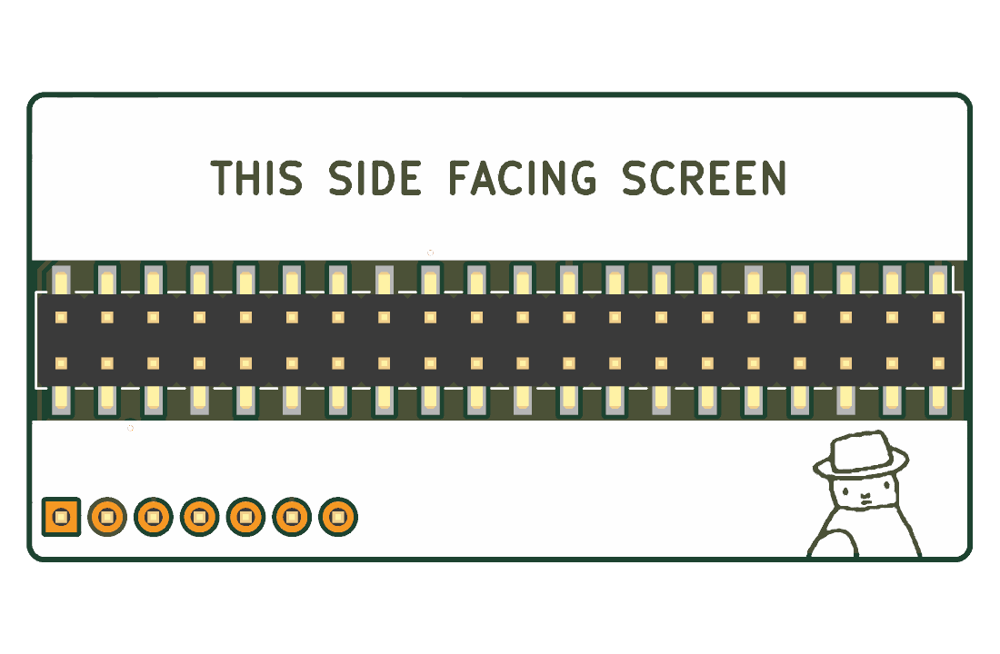
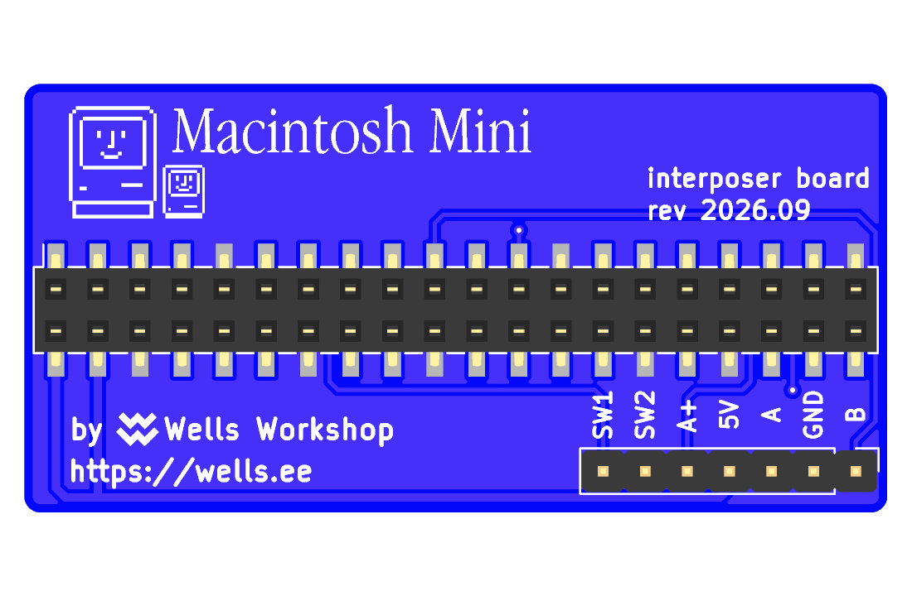

# Macintosh Mini GPIO interposer

 

A 52 × 26 mm, 2-layer KiCad 10 board that sits on the 40-pin header between the Pi Zero 2 W and the Waveshare 2.8" DPI display. Order it fully assembled — no soldering, and no bent, cut, or desoldered pins on the Pi.

An SMD socket underneath plugs onto the Pi and an SMD pin header on top plugs into the display. 35 pins pass straight through (one via each); the five GPIOs the [breakout PCB](../maclock-pcb/) uses (header pins 13, 19, 23, 35, 37) connect to the Pi side **only** and never reach the display, which otherwise fights the dial and buttons. Those five plus 5V and GND come out on a straight 1×7 header (J2) at the GPIO 21 end, pins pointing back toward the Pi, in the same order as the breakout's `Pi GPIO` header — one straight 1×7 Dupont cable connects the two.

The board is drawn the way it sits in the Maclock: Pi mounted upside-down, seen from the screen. Order it with **blue solder mask and white silkscreen** — the screen side is inverted (silk is the background, the lettering is bare mask); branding and the J2 pin labels are on the Pi side.

| J2 pin | Silk | Net   | Pi header pin | GPIO |
| ------ | ---- | ----- | ------------- | ---- |
| 1      | B    | ENC_B | 19            | 10   |
| 2      | GND  | GND   | 20 (all GNDs) | —    |
| 3      | A    | ENC_A | 23            | 11   |
| 4      | 5V   | 5V    | 2, 4          | —    |
| 5      | A+   | AUDIO | 35            | 19   |
| 6      | SW2  | BTN2  | 37            | 26   |
| 7      | SW1  | BTN1  | 13            | 27   |

## Bill of materials

| Ref | Qty | Part                                                                  | LCSC                                                                  | Notes                                             |
| --- | --- | --------------------------------------------------------------------- | --------------------------------------------------------------------- | ------------------------------------------------- |
| J1  | 1   | 2×20 female socket, 2.54 mm, SMD, 8.5 mm — Hong Cheng `HC-PM254-8.5H-2x20PS` | [`C22436166`](https://www.lcsc.com/product-detail/C22436166.html) | **Bottom** side, plugs onto the Pi                |
| J3  | 1   | 2×20 pin header, 2.54 mm, SMD — Hanbo `HB-PH9-254220PB2GOP`            | [`C6332245`](https://www.lcsc.com/product-detail/C6332245.html)       | Top side, plugs into the display                  |
| J2  | 1   | 1×7 straight pin header, 2.54 mm, THT — XFCN `PZ254V-11-07P`           | [`C492406`](https://www.lcsc.com/product-detail/C492406.html)         | **Bottom** (Pi) side, same part as the breakout's `Pi GPIO` header |

Both sides carry parts, so order two-sided assembly. Before ordering, check the J1/J3 drawings for locating pegs — the footprints are KiCad's generic peg-less SMD lands (3.0 / 3.15 × 1.0 mm pads, ±2.52 mm from the centreline).

## Use

Stack Pi → interposer → display (silk: `THIS SIDE FACING PI` / `THIS SIDE FACING SCREEN`). Run a straight 1×7 Dupont cable from J2 to the breakout's `Pi GPIO` header, pin 1 (`B`, square pad, GPIO 21 end) to pin 1 (`Dial B`).

The interposer adds about 12.5 mm between the Pi and the display (8.5 mm socket + 1.6 mm PCB + 2.5 mm header base), and the board reaches ~9 mm past the Pi's header edge, with J2's pins and the Dupont plug pointing back past the Pi — check both against your case before ordering.

## License

CC BY-NC-SA 4.0, same as the [breakout PCB](../maclock-pcb/LICENSE).
